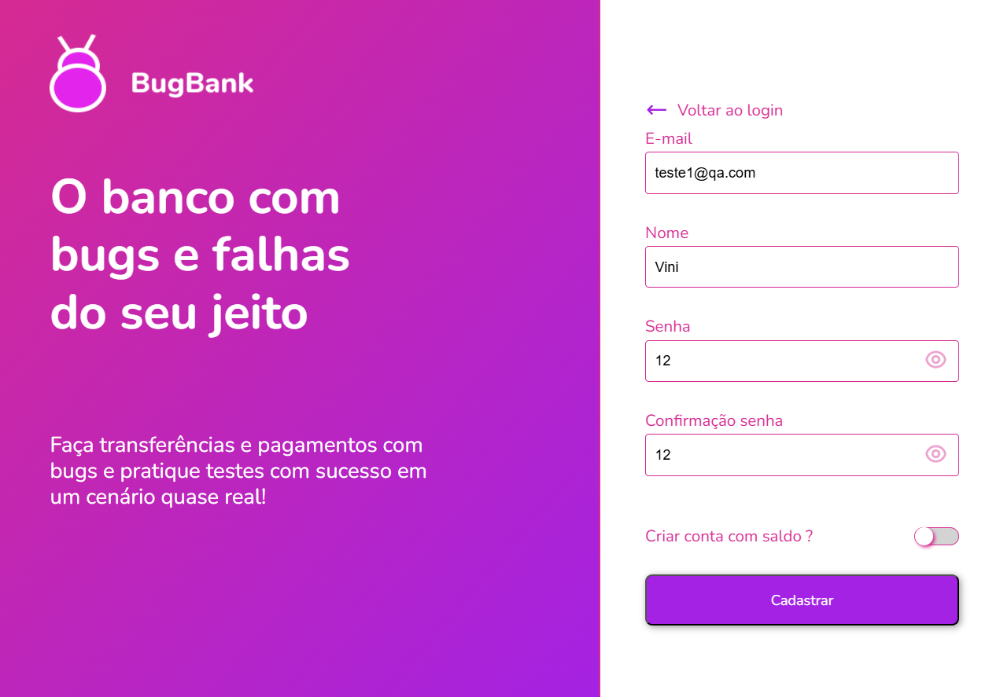
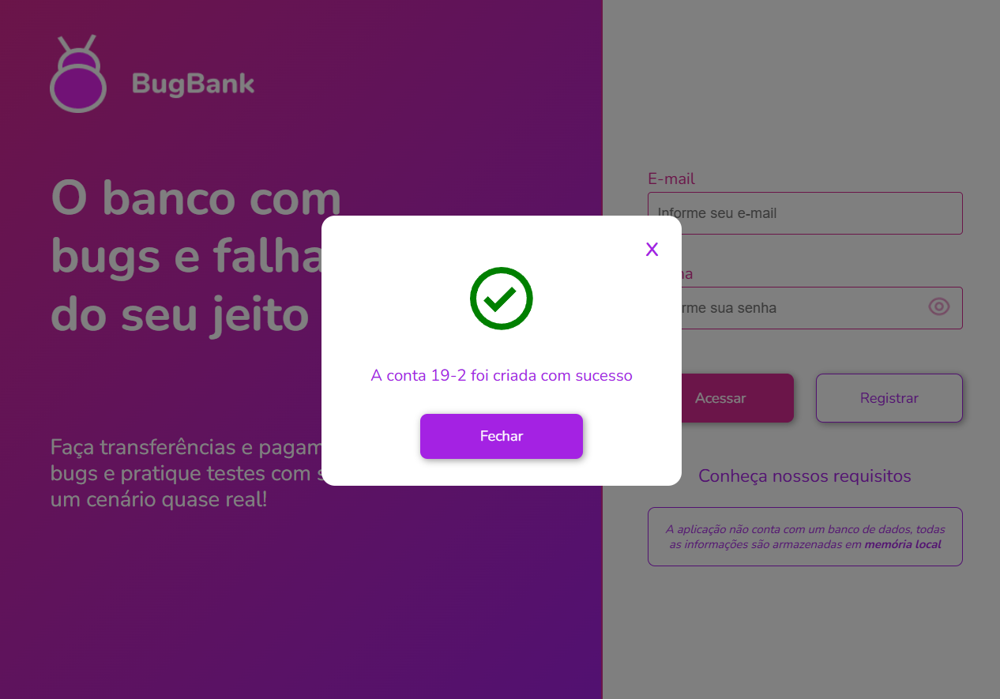
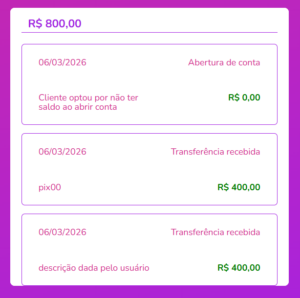

# Relatório de Bugs — BugBank

Este documento reúne os bugs encontrados durante a execução dos testes manuais no BugBank.

---

## BUG-001 | Sistema aceita senha com apenas 2 dígitos no cadastro

**ID do Caso de Teste relacionado:** CT-003  
**Severidade:** Alta  
**Prioridade:** Média  

**Pré-condições:**  
Estar na tela de cadastro do BugBank.

**Base para o teste:**  
Assunção de Requisito nº 01 do plano de testes — a senha deve ter no mínimo 6 caracteres.

**Passos para reprodução:**
1. Preencher o nome com "Teste Senha".
2. Preencher o e-mail com "teste03@qa.com".
3. Preencher a senha com "12".
4. Confirmar a senha com "12".
5. Clicar em "Cadastrar".

**Resultado Esperado:**  
O sistema deve impedir o cadastro e exibir mensagem de erro informando que a senha não atende ao tamanho mínimo esperado.

**Resultado Obtido:**  
O sistema criou a conta normalmente, aceitando uma senha com apenas 2 dígitos.

**Evidências:**  
Tela de preenchimento do cadastro:  

Tela de confirmação do cadastro realizado com sucesso:  

**Ambiente:**  
- Navegador: Google Chrome (aba anônima)
- Sistema: BugBank (https://bugbank.netlify.app)

---

## BUG-002 | Extrato não exibe o tipo da transação

**ID do Caso de Teste relacionado:** CT-010  
**Severidade:** Média  
**Prioridade:** Média  

**Pré-condições:**  
Ter ao menos uma transferência realizada entre duas contas.

**Base para o teste:**  
Assunção de Requisito — o extrato deve apresentar informações suficientes para identificação da transação, incluindo data, valor e tipo.

**Passos para reprodução:**
1. Realizar uma transferência entre duas contas.
2. Acessar a aba "Extrato" da conta de origem.
3. Verificar as informações exibidas para a transação registrada.
4. Repetir a verificação na conta de destino.

**Resultado Esperado:**  
O extrato deve exibir a data, o valor e o tipo da transação, permitindo identificar se a movimentação foi enviada ou recebida.

**Resultado Obtido:**  
O extrato exibiu a data e o valor da transação, porém não apresentou o tipo da movimentação.

**Evidência:**  
Print do extrato sem o tipo da transação:  

**Ambiente:**  
- Navegador: Google Chrome (aba anônima)
- Sistema: BugBank (https://bugbank.netlify.app)
